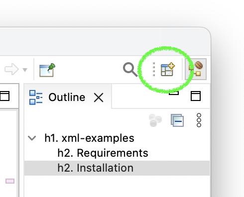
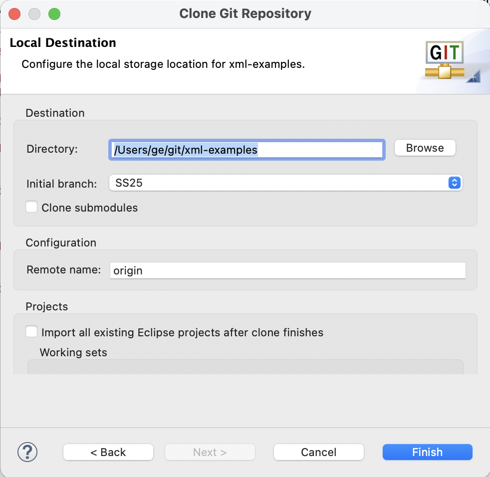

# xml-examples
This repo extends the eclipse demo-project "XMLExamples" with some examples that I develop during the lecture and lab of my course "Datamanagement with XML" held at FH Vorarlberg. The eclipse project has been renamed to "xml-examples" for this purpose.

## Requirements
This repo contains a project for the Eclipse IDE, hence, you will need a running Eclipse installation. I strongly recommend a recent **Eclipse IDE for Enterprise Java and Web Developers**. For me, the easiest way to do that is by using the eclipse installer, which you can download here: [Eclipse Installer](https://www.eclipse.org/downloads/packages/installer).

In order to download this project, or better "git clone" this project, you can use Eclipse's built in git tools.

## Installation

1. In Eclipse: open the perspective browser ...  
   
1. ... and select the Git perspective.  
   
1. Clone the SS25 branch by opening the clone tool in the view "Git Repositories" ...  
   
1. ... and choosing GitHub and (Next >).  
   
1. Enter "geschwaerzler/" in the search field, push (Search), select the repo geschwaerzler/xml-examples and (Next >).  
   
1. (Deselect All) branches and select "SS25" as inital branch and (Next >).  
   
1. Remember the directory location of the repo on your local disk and (Finish). The repo should not be located in your Eclipse workspace!  
   
